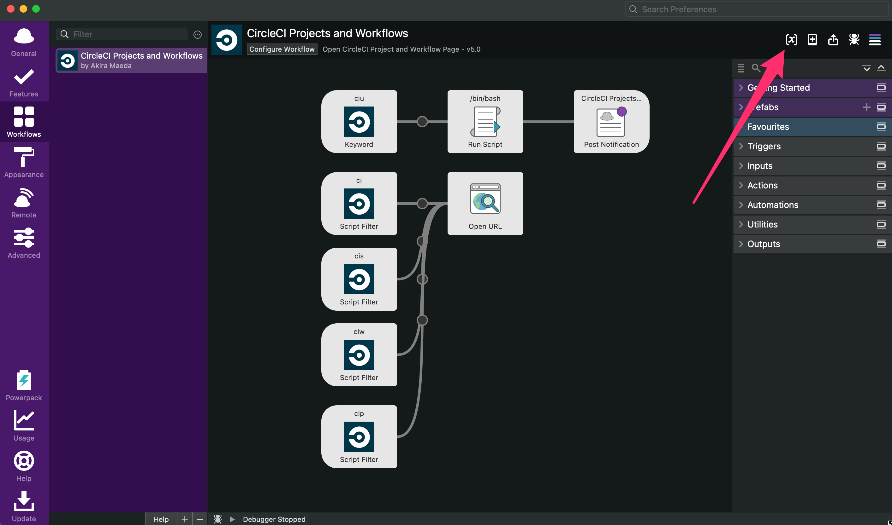
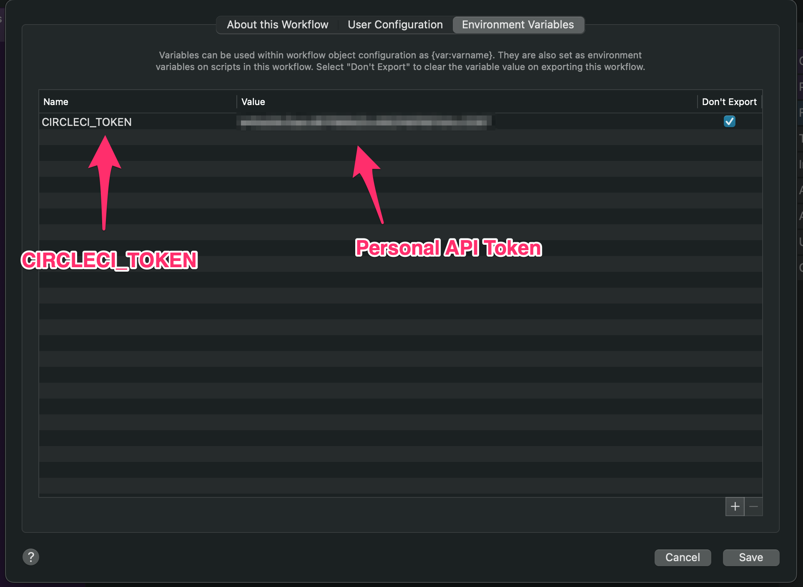

# CircleCI Projects Workflow for Alfred v5

## Setup

1. Download and install workflow https://github.com/glidenote/alfred-circleci-projects-workflow/releases/

### Setting Workflow Environment Variables

1. Generate your CircleCI api token https://circleci.com/account/api
1. Set your CircleCI token in `Workflow Environment Variables`
1. `CIRCLECI_TOKEN`

## Commands

### ciu

Cache api response to `/var/tmp/circleci.json`

### ci

Open CircleCI Projects Page.
`ci` command uses cache file `/var/tmp/circleci.json`

### cis

Check master branch build status.
`cis` command uses CircleCI api server.

### ciw

Open CircleCI Workflows Page.
`ciw` command uses cache file `/var/tmp/circleci.json`

### cip

Open CircleCI Pipelines Page.
`cip` command uses cache file `/var/tmp/circleci.json`
