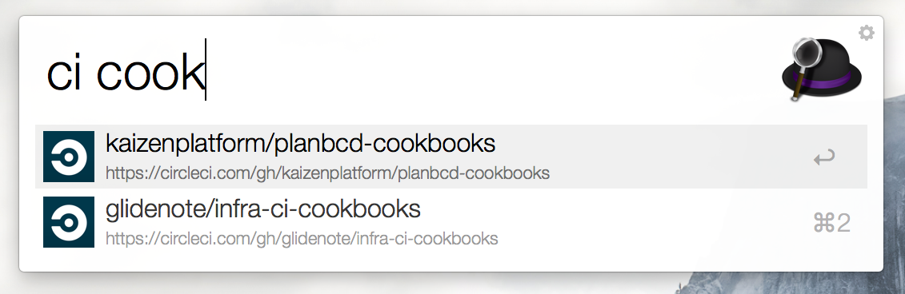
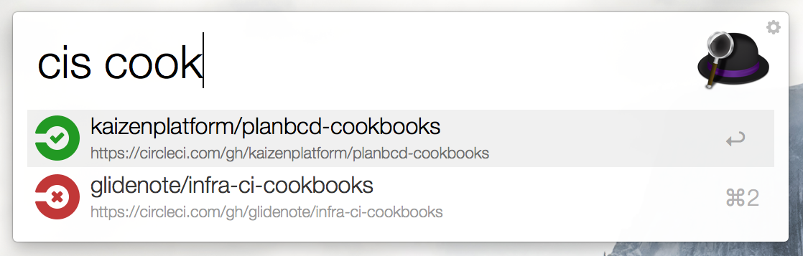
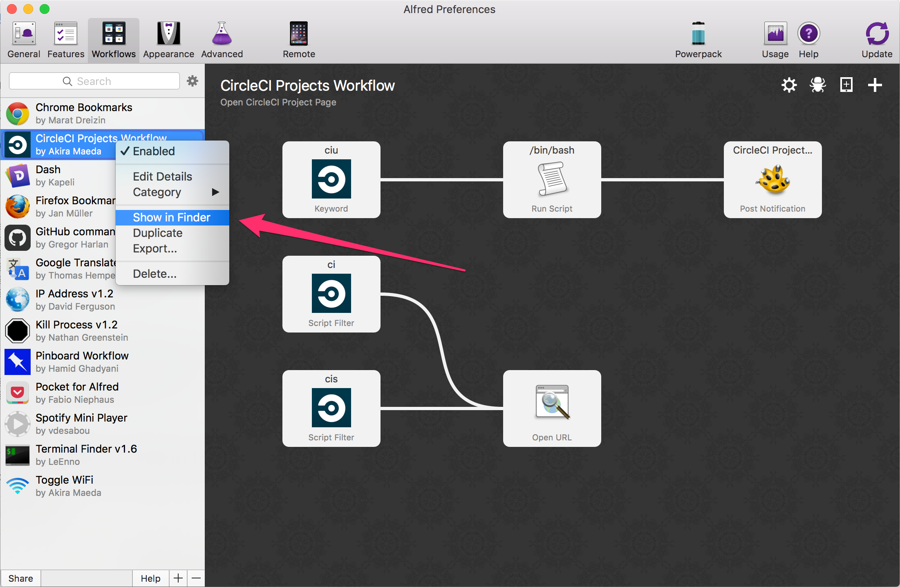
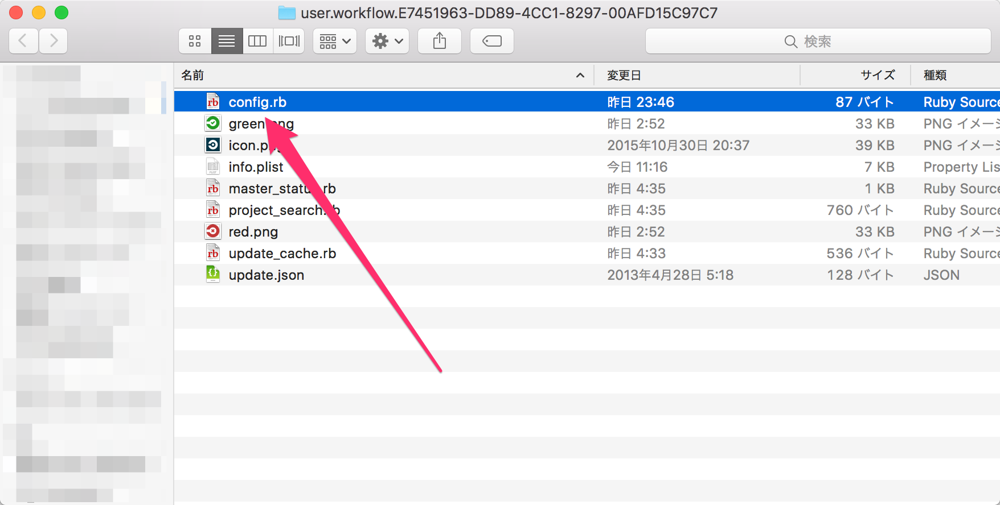

# CircleCI Projects Workflow for Alfred 2

## Setup

1. Generate your CircleCI api token https://circleci.com/account/api
1. Set your token file in `config.rb`

## Commands

### ciu

Cache api response to `/var/tmp/circleci.json`

### ci

Open CircleCI Projects Page.
`ci` command uses cache file `/var/tmp/circleci.json`

### cis

Check master branch build status.
`cis` command uses CircleCI api server.

